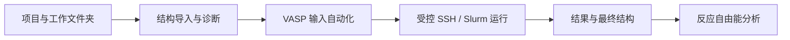

# CatEx

[](https://github.com/yelloooooooow/CatEx/actions/workflows/core-ci.yml)


**CatEx (Catalysis Exploration Workbench)** 是一个面向周期性催化材料、VASP 和 Slurm HPC 的本地 Web 科研工作台。它把结构准备、VASP 输入、受控远程计算、结果解析和反应自由能分析放进一条可追踪的工作流，同时保留必要的科学判断和提交确认。

> **当前状态：v0.27.0 Research Preview。** 已完成小规模单作业端到端流程验证，可作为“可用初版”试用；它还不是无人值守的生产级高通量平台，也不会替代研究者对结构、计算协议和结果的科学判断。

_CatEx is a local-first web workbench for traceable periodic-catalysis workflows with VASP and Slurm. The current release is a research preview validated for controlled, single-job workflows._

## 为什么做 CatEx

一次催化计算通常横跨多个彼此割裂的工具：结构文件、VASP 输入、SSH 客户端、Slurm、输出解析脚本和作图程序。CatEx 为这些步骤提供一个统一工作台，重点解决：

- 输入文件散落、版本和来源难以追踪；
- POSCAR、INCAR、KPOINTS、POTCAR 顺序或参数不一致；
- 本地文件与远端实际提交内容难以对应；
- 计算是否收敛、为何结束和最终结构需要人工翻找输出；
- 多个中间体的能量与热化学校正难以一致地汇总成反应台阶图；
- 自动化工具权限过大，容易误覆盖目录、泄露凭据或重复提交。

CatEx 不为“文献复现”和“原创研究”维护两套核心。研究目的记录为项目元数据，结构、协议、运行和结果仍走同一套可配置流程。

## 工作流



| 阶段 | 当前能力 |
| --- | --- |
| 项目 | 项目元数据、Artifact、SHA-256、来源与派生关系 |
| 结构 | POSCAR/CONTCAR/CIF 导入、CIF→POSCAR、球棍模型、几何诊断 |
| 约束 | 通过 Selective Dynamics 固定基底层或仅放开指定吸附物原子，并在应用前高亮预览 |
| VASP 输入 | 工作文件夹自动读取、逐文件替换、INCAR 表格编辑、KPOINTS 配置与一致性检查 |
| POTCAR | 按 POSCAR 元素顺序验证脱敏元数据，在授权远端目录中受控生成并保存本地副本 |
| Slurm | 结构化资源配置、最长时间与站点上限校验、唯一运行目录、单次提交和只读观察 |
| 结果 | 结束原因、电子/离子收敛、能量、力、磁矩、振动频率和最终球棍结构 |
| 反应分析 | HER/OER 模板、多结果绑定、热化学校正和自由能台阶图 |
| 交互 | 中文/English 切换、工作流节点跳转、Windows 双击启动 |

## 设计原则

- **Local first**：Web API 和前端默认只监听 `127.0.0.1`。
- **Provenance first**：结构、协议、运行和结果通过内容哈希与显式来源绑定。
- **Fail closed**：缺少必要输入、顺序不一致或证据不足时停止，而不是猜测或静默修复。
- **Bounded automation**：远端只能在用户允许的根目录下创建全新直接子目录；不覆盖、不清理既有路径。
- **Human in the loop**：远端写入和 `sbatch` 提交分别确认；科学参数不会被系统自动“批准”。
- **Licensed data stays local**：VASP、POTCAR、论文 PDF 和大型计算输出不进入 Git 或项目导出包。

## 快速开始

### 环境要求

- Windows 10/11（当前桌面工作台的主要验证平台）；
- Python 3.12 或更高版本；
- Node.js 24 与 pnpm 11.9；
- 需要远端计算时：用户自行获得许可的 VASP/POTCAR、SSH 访问和 Slurm 账户。

仅浏览界面、管理结构和运行自动测试时，不需要连接 HPC，也不需要本地安装 VASP。

### 安装

```powershell
git clone https://github.com/yelloooooooow/CatEx.git
cd CatEx

python -m venv .venv
.\.venv\Scripts\python.exe -m pip install --upgrade pip
.\.venv\Scripts\python.exe -m pip install -e ".[web,dev]"

pnpm install --frozen-lockfile
```

### 启动工作台

Windows 用户可以双击仓库根目录中的：

```text
启动 CatEx 工作台.cmd
```

也可以在终端启动：

```powershell
pnpm web:poc
```

启动器会检查依赖、启动本地 API 和前端，并打开浏览器。使用期间保留启动窗口；按回车停止本次启动的服务。

## 第一次计算

推荐先使用一个很小、参数明确、不会产生大量输出的测试体系：

1. 创建 CatEx 项目并选择一个本地工作文件夹。
2. 导入 POSCAR、CONTCAR 或 CIF；检查结构、成键和警告。
3. 如需弛豫约束，启用 Selective Dynamics 并预览固定/移动原子。
4. 导入或编辑 INCAR、KPOINTS，核对元素顺序和计算协议。
5. 在运行中心临时导入 SSH 配置，固定主机密钥，并执行只读连接测试。
6. 填写远端项目名、允许的远端根目录、POTCAR 库位置和结构化 Slurm 参数。
7. 读取并确认 POTCAR 元数据；需要时生成并保存本次 POTCAR。
8. 点击“检查完整性并进入运行中心”，修复所有阻断项。
9. 分别确认远端准备与作业提交，随后只读观察队列和运行状态。
10. 在“计算结果”查看收敛结论、最终结构和数值结果；在“反应分析”绑定多个中间体并绘图。

完整操作说明见 [CatEx Workbench 使用指南](docs/WEB_POC.md)。

## HPC 与数据安全

CatEx 的远端运行能力刻意受限：

- SSH 主机、端口、用户名、私钥路径、主机密钥和远端路径只在当前会话内使用，不写入项目数据库或 Git；
- 本机连接 JSON 用于临时填表，不应提交到仓库；页面刷新后需要重新导入；
- 不自动接受未知 SSH 主机，推荐固定 SHA-256 主机密钥；
- 每次计算使用全新的唯一远端目录；已存在目录不会复用，以避免混算和覆盖；
- POTCAR 只在已授权环境中处理，Git 仅允许保存不含原文的元数据；
- 结果下载白名单排除 POTCAR、WAVECAR、CHGCAR 等许可或大型文件；
- 当前没有远端删除、自动清理、取消作业、自动续算或无人值守批量提交接口。

请勿在 Issue、截图、日志或示例配置中公开真实凭据、私钥、VPN 配置、服务器地址、用户名、主机指纹或个人路径。详见 [数据与执行安全策略](docs/SECURITY_AND_DATA_POLICY.md)。

## 项目结构

```text
apps/web/                 React + TypeScript Web Workbench
src/catex/                结构、VASP、Slurm 与催化科学核心
src/catex_app/            项目、Artifact 和工作流应用层
src/catex_web/            本地 FastAPI 服务
tests/                    Python 测试与合成夹具
projects/                 参考案例与科研验收清单
docs/                     设计、协议、安全和使用文档
```

## 开发与测试

```powershell
python -m ruff format --check src tests
python -m ruff check .
python -m pytest --cov=catex --cov-fail-under=90 -q

pnpm web:check
pnpm web:test
pnpm web:build
```

CI 在 Python 3.12、Node.js 24 和 pnpm 11.9 环境中执行格式检查、静态检查、测试、覆盖率门禁以及前后端构建。真实 HPC 作业不会在 CI 中运行。

## 科学范围

当前重点：

- 周期性非均相催化和电催化；
- VASP 5.4.4 输入/输出与 Slurm 单作业生命周期；
- 吸附构型、选择性弛豫、振动热化学、HER/OER 自由能分析；
- 文献复现、原创研究和实验解释共用的可追踪工作流。

当前不承诺：

- 泛函、赝势或电子结构方法开发；
- 自动选择“最佳”DFT 参数；
- 无人审核的高通量筛选、主动学习或自动纠错续算；
- 通过少量数值自动宣称机理、活性、选择性、氧化态或磁基态；
- 支持所有 VASP 版本、调度器和 HPC 站点约定。

## 文档

- [项目执行计划](docs/PROJECT_EXECUTION_PLAN.md)
- [架构决策](docs/adr/0001-platform-architecture.md)
- [Web Workbench 架构](docs/adr/0003-web-workbench-architecture.md)
- [VASP 输入验证](docs/VASP_INPUT_VALIDATION.md)
- [VASP 输出解析](docs/VASP_OUTPUT_PARSING.md)
- [协议与 Slurm 规划](docs/PROTOCOL_AND_SLURM_DRY_RUN.md)
- [POTCAR 脱敏元数据](docs/HPC_POTCAR_METADATA.md)
- [反应与热化学](docs/REACTION_THERMOCHEMISTRY.md)
- [反应网络与 CHE](docs/REACTION_NETWORK_CHE_AND_READINESS.md)

## 生态与定位

CatEx 使用 [pymatgen](https://github.com/materialsproject/pymatgen) 处理材料结构和 VASP 文件，并采用 FastAPI、React 与 Paramiko 构建本地交互和受控连接。项目在产品表达上参考了 [atomate2](https://github.com/materialsproject/atomate2) 对可组合材料工作流的介绍、[AiiDA](https://github.com/aiidateam/aiida-core) 对 provenance/HPC 的强调，以及 [custodian](https://github.com/materialsproject/custodian) 对计算错误管理边界的说明；CatEx 与这些项目没有隶属关系，也不试图替代它们。

## 路线图

- 用更多真实、小规模科研案例完成端到端验收；
- 增加批量设计空间、任务队列和可恢复运行，但继续保留明确权限边界；
- 扩展反应模板、热化学校正、电子结构分析和可导出科研图表；
- 提供更完整的部署、迁移、版本升级与贡献文档；
- 在许可证和引用信息确定后发布正式版本。

## 许可证与引用

本仓库目前**尚未选择开源许可证**。公开可见不等于获得复制、修改或再分发授权；在许可证文件加入前，保留所有权利。VASP、POTCAR、Materials Studio 及第三方数据分别受其自身许可约束，本仓库不分发这些内容。

CatEx 尚未发布对应论文或正式软件版本。当前科研使用请记录仓库 URL、版本号和具体提交哈希，以保证可追踪性。

## 反馈

欢迎通过 GitHub Issues 提交可复现的缺陷、文档问题和功能建议。请使用合成或充分脱敏的数据，不要附带真实凭据、服务器信息、POTCAR 原文或受版权限制的论文附件。
